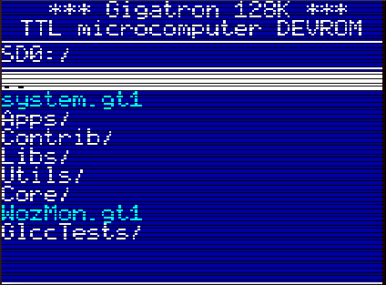
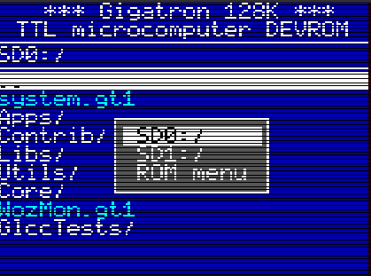
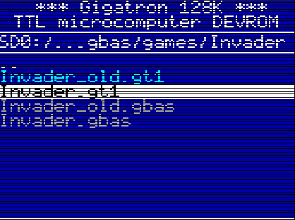
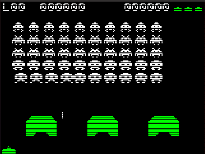

# Readonly browser and loader

This code implements a file browser that can be used to navigate the 
directories and execute any GT1 file present on a SD card attached to the RAM & I/O 
expansion SPI0 port.  It supports FAT filesystems with long file names (up to 25 characters).

### 1. Prerequisites

Your Gigatron must be equipped with a RAM and IO expansion card such
one described in https://github.com/lb3361/gigatron-lb/tree/main/extension-retro, such as
Marcel's original design all the patches described in https://forum.gigatron.io/viewtopic.php?p=1192#p1192,
or Hans61's combined memory expansion and video repeater described in https://forum.gigatron.io/viewtopic.php?p=2606#p2606.
Your Gigatron must also be equipped with a recent version of the DEVROM such as
the one provided in the 'binaries' directory. 

### 2. Compilation

Compile with GLCC (https://github.com/lb3361/gigatron-lcc) using the command 'make'.
This creates a program named system.gt1 that goes into the main directory of your FAT32 formatted SD card.
For convenience, a precompiled binary is provided in the directory 'binaries'.

### 2. Operation

* Format the SD card with a FAT32 filesystem. How to do this depends on your operating system. Under Linux, you can use 'fdisk' to create a single partition of type 'c' then use 'mkdosfs -F 32 /dev/*sdCardCevice*'. Under Windows, investigate https://kb.sandisk.com/app/answers/detail/a_id/22476/~/formatting-sandisk-memory-card-products-in-fat32-format-using-third-party.
* Copy 'system.gt1' into the root directory.
* Add GT1 files of interest to the SD card, possibly in subdirectories
* Insert the SD card in a SD breakout connected to port SPI0 of the RAM & IO expansion board.
* Reboot your gigatron.

Use the up and down arrows to select a file or a directory.
To enter a directory or execute a GT1 file, use button A, the right arrow, or the enter key.
To return to the parent directory, enter the '..' directory or use the left arrow.
When the program starts, it searched for a file named 'autoexec.gt1' and executes it right away 
if it is found. Hold button B when the program starts to prevent this from happening.

### 3. Screenshots

